# Custom SDR Board Project Plan
## X410 Clone with MPSoC + QDMA Architecture

---

# Project Overview

## Goal
X410 기반 Custom SDR 보드 개발 (PCIe QDMA 인터페이스)

## Key Differences from X410
| Feature | X410 | Custom Board |
|---------|------|--------------|
| SoC | RF-SoC (ZU28DR) | **MPSoC (ZU19EG)** |
| ADC/DAC | Integrated | External (TI AFE) |
| Host Interface | Ethernet (DPDK) | **PCIe (QDMA)** |
| PLL | LMK04832 | Renesas 8A34001 |
| Transport | UDP/DPDK | **QDMA DMA** |

---

# System Architecture

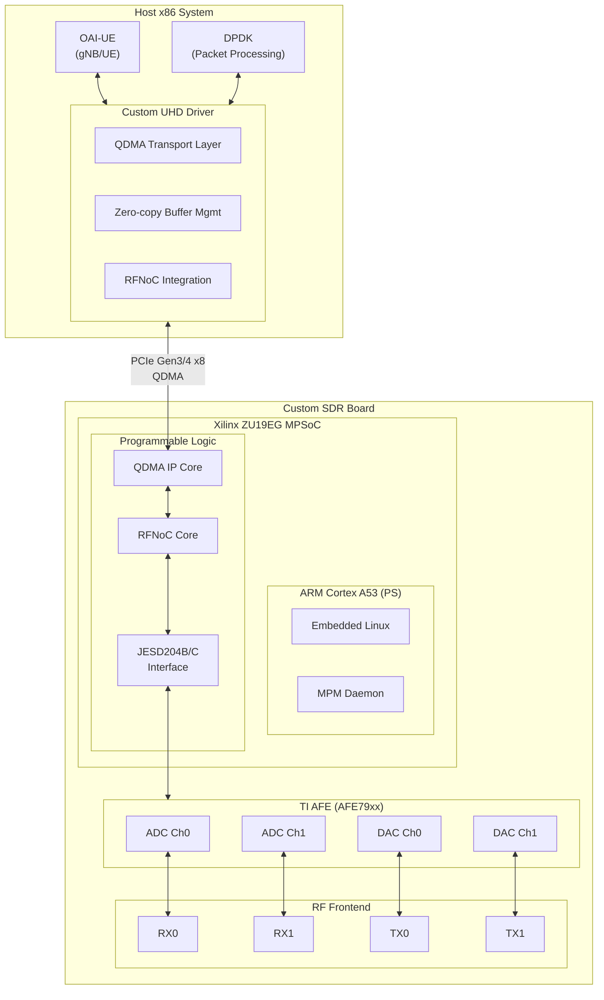
```mermaid
flowchart TB
    subgraph HOST["Host x86 System"]
        OAI["OAI-UE<br/>(gNB/UE)"]
        DPDK["DPDK<br/>(Packet Processing)"]
        subgraph UHD["Custom UHD Driver"]
            QDMA_TRANS["QDMA Transport Layer"]
            DMA_BUF["Zero-copy Buffer Mgmt"]
            RFNOC_INT["RFNoC Integration"]
        end
        OAI <--> UHD
        DPDK <--> UHD
    end

    subgraph SDR["Custom SDR Board"]
        subgraph MPSOC["Xilinx ZU19EG MPSoC"]
            subgraph PS["ARM Cortex A53 (PS)"]
                LINUX["Embedded Linux"]
                MPM["MPM Daemon"]
            end
            subgraph PL["Programmable Logic"]
                RFNOC["RFNoC Core"]
                QDMA_IP["QDMA IP Core"]
                JESD["JESD204B/C<br/>Interface"]
            end
        end

        subgraph AFE["TI AFE (AFE79xx)"]
            ADC0["ADC Ch0"]
            ADC1["ADC Ch1"]
            DAC0["DAC Ch0"]
            DAC1["DAC Ch1"]
        end

        subgraph RF["RF Frontend"]
            RX0["RX0"]
            RX1["RX1"]
            TX0["TX0"]
            TX1["TX1"]
        end
    end

    UHD <-->|"PCIe Gen3/4 x8<br/>QDMA"| QDMA_IP
    QDMA_IP <--> RFNOC
    RFNOC <--> JESD
    JESD <--> AFE
    ADC0 <--> RX0
    ADC1 <--> RX1
    DAC0 <--> TX0
    DAC1 <--> TX1
```

---

# X410 DPDK Architecture Reference

## DPDK Transport Layer (X410)

X410의 DPDK 구현을 참고하여 QDMA 기반으로 포팅

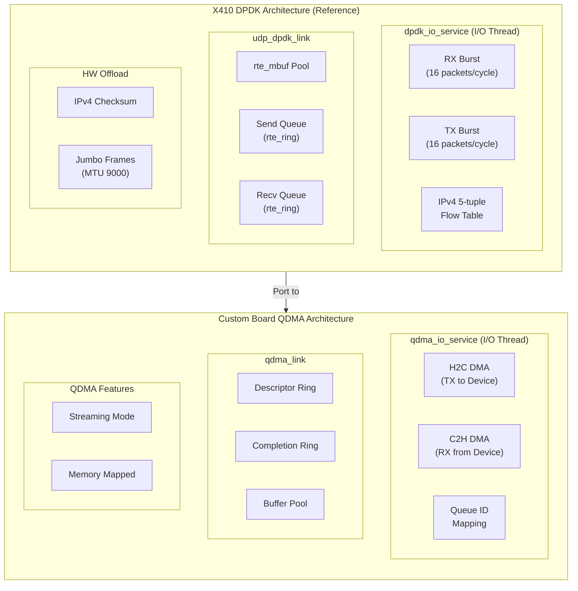
```mermaid
flowchart TB
    subgraph X410_ARCH["X410 DPDK Architecture (Reference)"]
        direction TB
        subgraph IO_SERVICE["dpdk_io_service (I/O Thread)"]
            RX_BURST["RX Burst<br/>(16 packets/cycle)"]
            TX_BURST["TX Burst<br/>(16 packets/cycle)"]
            FLOW_TABLE["IPv4 5-tuple<br/>Flow Table"]
        end

        subgraph TRANSPORT["udp_dpdk_link"]
            MBUF_POOL["rte_mbuf Pool"]
            SEND_QUEUE["Send Queue<br/>(rte_ring)"]
            RECV_QUEUE["Recv Queue<br/>(rte_ring)"]
        end

        subgraph OFFLOAD["HW Offload"]
            CKSUM["IPv4 Checksum"]
            JUMBO["Jumbo Frames<br/>(MTU 9000)"]
        end
    end

    subgraph CUSTOM_ARCH["Custom Board QDMA Architecture"]
        direction TB
        subgraph QDMA_SERVICE["qdma_io_service (I/O Thread)"]
            QDMA_RX["H2C DMA<br/>(TX to Device)"]
            QDMA_TX["C2H DMA<br/>(RX from Device)"]
            QUEUE_MAP["Queue ID<br/>Mapping"]
        end

        subgraph QDMA_TRANSPORT["qdma_link"]
            DESC_RING["Descriptor Ring"]
            CMPL_RING["Completion Ring"]
            BUFF_POOL["Buffer Pool"]
        end

        subgraph QDMA_OFFLOAD["QDMA Features"]
            ST_MODE["Streaming Mode"]
            MM_MODE["Memory Mapped"]
        end
    end

    X410_ARCH -->|"Port to"| CUSTOM_ARCH
```

## Key DPDK Parameters (from X410)

| Parameter | X410 Value | Custom Board (QDMA) |
|-----------|------------|---------------------|
| Burst Size | 16 packets | 16-32 descriptors |
| MTU | 9000 bytes | N/A (DMA) |
| Queue Depth | 4096 | 4096 |
| Buffer Cache | 64 per CPU | Per-queue pools |
| Max Flows | 128 | Queue-based routing |

## Reference Code Paths
- `host/lib/transport/uhd-dpdk/dpdk_io_service.cpp` - I/O thread main loop
- `host/lib/transport/udp_dpdk_link.cpp` - Buffer management
- `host/lib/usrp/mpmd/mpmd_link_if_ctrl_udp.cpp` - DPDK integration

---

# MPSoC Selection

## ZU19EG (Selected)

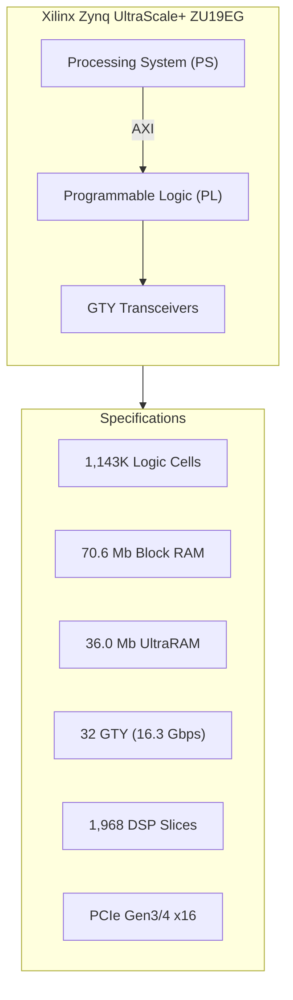
```mermaid
graph TB
    subgraph ZU19EG["Xilinx Zynq UltraScale+ ZU19EG"]
        direction TB
        PS_BLOCK["Processing System (PS)"]
        PL_BLOCK["Programmable Logic (PL)"]
        GTY_BLOCK["GTY Transceivers"]

        PS_BLOCK --> |"AXI"| PL_BLOCK
        PL_BLOCK --> GTY_BLOCK
    end

    subgraph SPECS["Specifications"]
        LOGIC["1,143K Logic Cells"]
        BRAM["70.6 Mb Block RAM"]
        URAM["36.0 Mb UltraRAM"]
        GTY["32 GTY (16.3 Gbps)"]
        DSP["1,968 DSP Slices"]
        PCIE["PCIe Gen3/4 x16"]
    end

    ZU19EG --> SPECS
```

### ZU19EG Specifications
| Parameter | Value |
|-----------|-------|
| Logic Cells | 1,143K |
| Block RAM | 70.6 Mb |
| UltraRAM | 36.0 Mb |
| GTY Transceivers | 32 (16.3 Gbps each) |
| DSP Slices | 1,968 |
| PCIe Support | Gen3/4 x16 |
| PS DDR4 | Up to 2400 MT/s |

### Why ZU19EG?
- **More Logic**: 1,143K vs 599K (ZU9EG) - 더 많은 RFNoC 블록 가능
- **More GTY**: 32개 - JESD204C + PCIe 동시 지원
- **UltraRAM**: 36 Mb - 대용량 버퍼링
- **PCIe Gen4**: 최대 x16 레인 지원

---

# TI AFE Selection

## AFE7950 (Recommended)

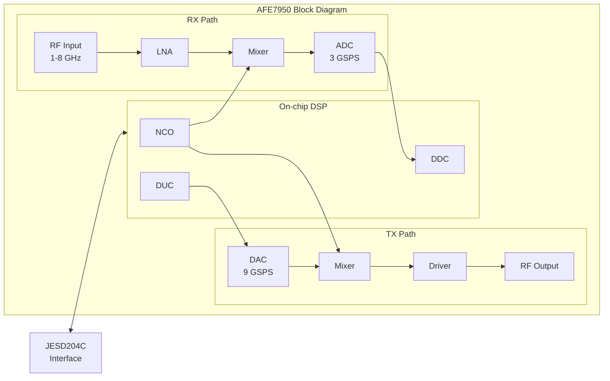
```mermaid
flowchart LR
    subgraph AFE7950["AFE7950 Block Diagram"]
        direction TB
        subgraph RX["RX Path"]
            RF_RX["RF Input<br/>1-8 GHz"] --> LNA["LNA"]
            LNA --> MIX_RX["Mixer"]
            MIX_RX --> ADC["ADC<br/>3 GSPS"]
        end

        subgraph TX["TX Path"]
            DAC["DAC<br/>9 GSPS"] --> MIX_TX["Mixer"]
            MIX_TX --> PA["Driver"]
            PA --> RF_TX["RF Output"]
        end

        subgraph DSP["On-chip DSP"]
            NCO["NCO"]
            DDC["DDC"]
            DUC["DUC"]
        end

        ADC --> DDC
        DUC --> DAC
        NCO --> MIX_RX
        NCO --> MIX_TX
    end

    JESD["JESD204C<br/>Interface"] <--> DSP
```

### Specifications
| Parameter | Value |
|-----------|-------|
| ADC Channels | 4 |
| DAC Channels | 4 |
| ADC Sample Rate | 3 GSPS |
| DAC Sample Rate | 9 GSPS |
| RF Bandwidth | 400 MHz |
| Interface | JESD204C |

---

# Clock Architecture

## Renesas 8A34001 Network Synchronizer

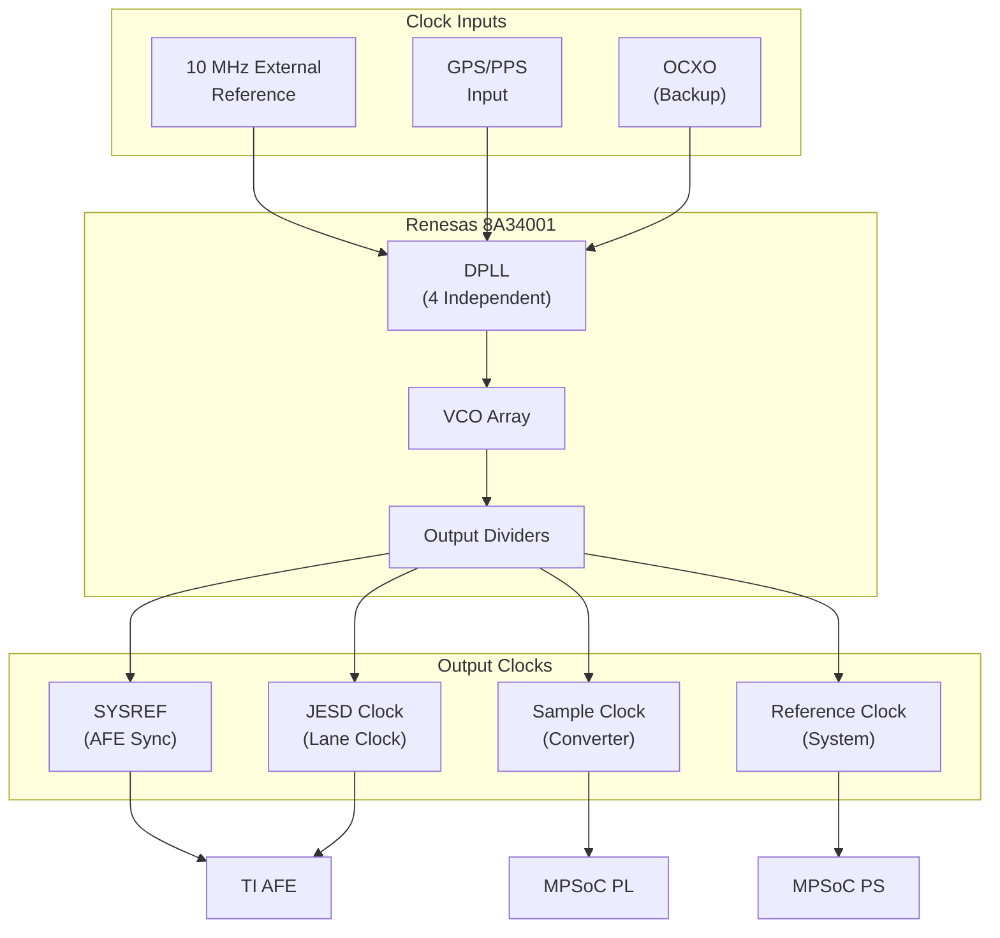
```mermaid
flowchart TB
    subgraph INPUTS["Clock Inputs"]
        EXT["10 MHz External<br/>Reference"]
        GPS["GPS/PPS<br/>Input"]
        OCXO["OCXO<br/>(Backup)"]
    end

    subgraph PLL["Renesas 8A34001"]
        direction TB
        DPLL["DPLL<br/>(4 Independent)"]
        VCO["VCO Array"]
        DIV["Output Dividers"]

        DPLL --> VCO
        VCO --> DIV
    end

    subgraph OUTPUTS["Output Clocks"]
        SYSREF["SYSREF<br/>(AFE Sync)"]
        JESD_CLK["JESD Clock<br/>(Lane Clock)"]
        SAMPLE["Sample Clock<br/>(Converter)"]
        REF["Reference Clock<br/>(System)"]
    end

    EXT --> DPLL
    GPS --> DPLL
    OCXO --> DPLL

    DIV --> SYSREF
    DIV --> JESD_CLK
    DIV --> SAMPLE
    DIV --> REF

    SYSREF --> AFE_DEST["TI AFE"]
    JESD_CLK --> AFE_DEST
    SAMPLE --> MPSOC_PL["MPSoC PL"]
    REF --> MPSOC_PS["MPSoC PS"]
```

### Key Features
- 4 independent DPLLs
- Sub-ns jitter performance (<100 fs RMS)
- IEEE 1588/SyncE support
- Programmable via I2C/SPI

---

# QDMA Interface Design

## QDMA vs XDMA Comparison

| Feature | XDMA | QDMA |
|---------|------|------|
| Queues | 4 H2C + 4 C2H | **2048 H2C + 2048 C2H** |
| Mode | Memory Mapped | **Streaming + MM** |
| Descriptors | Ring | **Ring + Completion** |
| Interrupt | MSI/MSI-X | **MSI-X (2048 vectors)** |
| Performance | Good | **Better (lower latency)** |

## QDMA Architecture

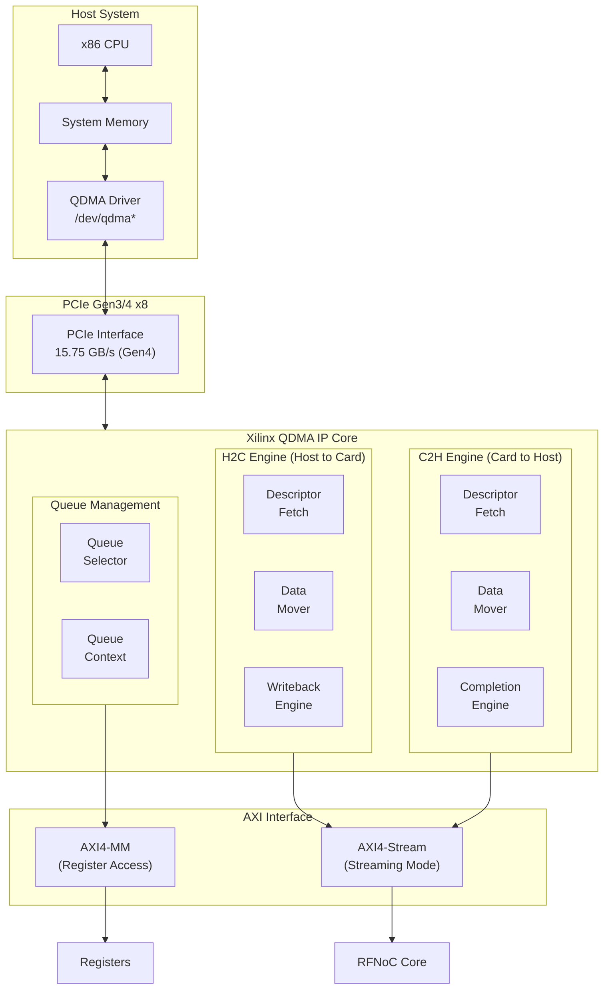
```mermaid
flowchart TB
    subgraph HOST["Host System"]
        CPU["x86 CPU"]
        MEM["System Memory"]
        QDMA_DRV["QDMA Driver<br/>/dev/qdma*"]
        CPU <--> MEM
        MEM <--> QDMA_DRV
    end

    subgraph PCIE["PCIe Gen3/4 x8"]
        PCIE_IF["PCIe Interface<br/>15.75 GB/s (Gen4)"]
    end

    subgraph QDMA_IP["Xilinx QDMA IP Core"]
        direction TB

        subgraph H2C["H2C Engine (Host to Card)"]
            H2C_DESC["Descriptor<br/>Fetch"]
            H2C_DATA["Data<br/>Mover"]
            H2C_WB["Writeback<br/>Engine"]
        end

        subgraph C2H["C2H Engine (Card to Host)"]
            C2H_DESC["Descriptor<br/>Fetch"]
            C2H_DATA["Data<br/>Mover"]
            C2H_CMPL["Completion<br/>Engine"]
        end

        subgraph QUEUES["Queue Management"]
            Q_SEL["Queue<br/>Selector"]
            Q_CTX["Queue<br/>Context"]
        end
    end

    subgraph AXI["AXI Interface"]
        AXI_ST["AXI4-Stream<br/>(Streaming Mode)"]
        AXI_MM["AXI4-MM<br/>(Register Access)"]
    end

    QDMA_DRV <--> PCIE_IF
    PCIE_IF <--> QDMA_IP
    H2C --> AXI_ST
    C2H --> AXI_ST
    QUEUES --> AXI_MM

    AXI_ST --> RFNOC["RFNoC Core"]
    AXI_MM --> REGS["Registers"]
```

## QDMA Queue Configuration

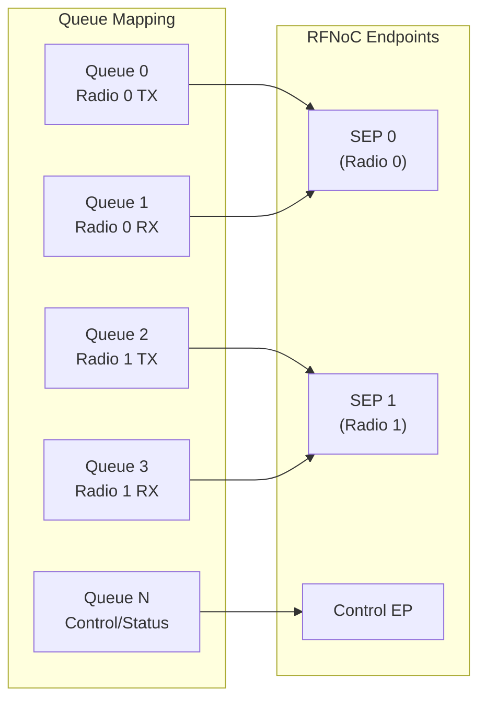
```mermaid
flowchart LR
    subgraph QUEUE_MAPPING["Queue Mapping"]
        Q0["Queue 0<br/>Radio 0 TX"]
        Q1["Queue 1<br/>Radio 0 RX"]
        Q2["Queue 2<br/>Radio 1 TX"]
        Q3["Queue 3<br/>Radio 1 RX"]
        Q_CTRL["Queue N<br/>Control/Status"]
    end

    subgraph RFNOC_EP["RFNoC Endpoints"]
        EP0["SEP 0<br/>(Radio 0)"]
        EP1["SEP 1<br/>(Radio 1)"]
        EP_CTRL["Control EP"]
    end

    Q0 --> EP0
    Q1 --> EP0
    Q2 --> EP1
    Q3 --> EP1
    Q_CTRL --> EP_CTRL
```

## Performance Targets
| Metric | Gen3 x8 | Gen4 x8 |
|--------|---------|---------|
| Theoretical BW | 7.88 GB/s | 15.75 GB/s |
| Effective BW | ~6.5 GB/s | ~13 GB/s |
| Latency | < 5 μs | < 3 μs |
| Queue Depth | 4096 | 4096 |

---

# Software Architecture

## Custom UHD Driver Stack (QDMA-based)

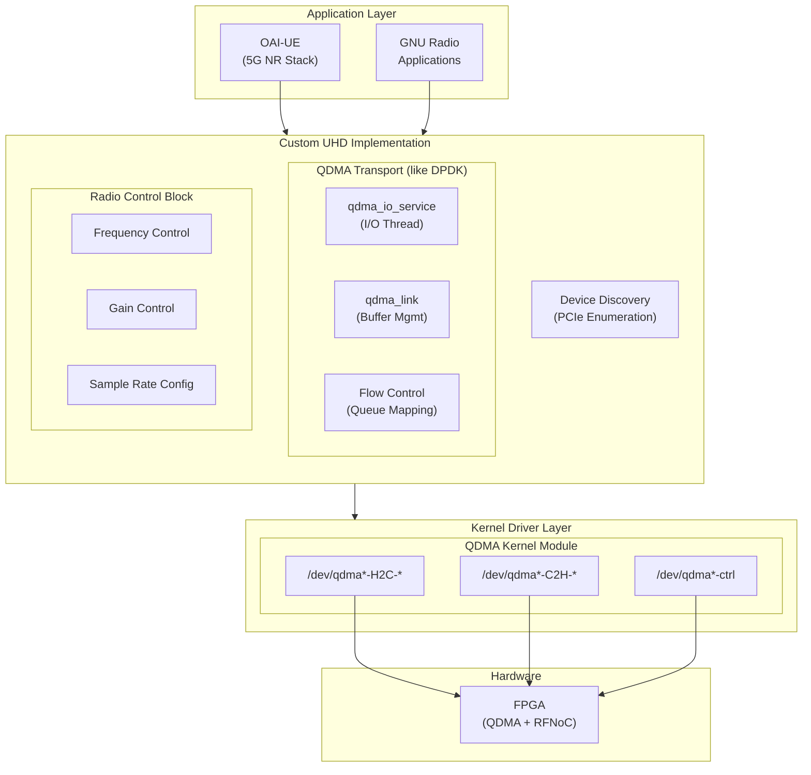
```mermaid
flowchart TB
    subgraph APP["Application Layer"]
        OAI["OAI-UE<br/>(5G NR Stack)"]
        GR["GNU Radio<br/>Applications"]
    end

    subgraph UHD["Custom UHD Implementation"]
        direction TB
        DISC["Device Discovery<br/>(PCIe Enumeration)"]

        subgraph QDMA_TRANS["QDMA Transport (like DPDK)"]
            IO_SVC["qdma_io_service<br/>(I/O Thread)"]
            QDMA_LINK["qdma_link<br/>(Buffer Mgmt)"]
            FLOW_CTRL["Flow Control<br/>(Queue Mapping)"]
        end

        subgraph RADIO["Radio Control Block"]
            FREQ["Frequency Control"]
            GAIN["Gain Control"]
            RATE["Sample Rate Config"]
        end
    end

    subgraph KERNEL["Kernel Driver Layer"]
        subgraph QDMA_MOD["QDMA Kernel Module"]
            H2C_DEV["/dev/qdma*-H2C-*"]
            C2H_DEV["/dev/qdma*-C2H-*"]
            CTRL_DEV["/dev/qdma*-ctrl"]
        end
    end

    subgraph HW["Hardware"]
        FPGA["FPGA<br/>(QDMA + RFNoC)"]
    end

    OAI --> UHD
    GR --> UHD
    UHD --> KERNEL
    H2C_DEV --> FPGA
    C2H_DEV --> FPGA
    CTRL_DEV --> FPGA
```

## QDMA I/O Service (Porting from DPDK)

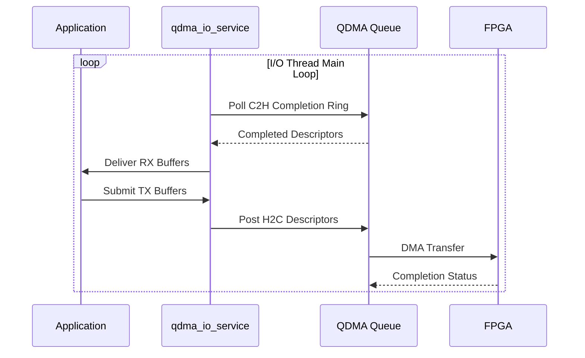
```mermaid
sequenceDiagram
    participant App as Application
    participant IO as qdma_io_service
    participant Q as QDMA Queue
    participant HW as FPGA

    loop I/O Thread Main Loop
        IO->>Q: Poll C2H Completion Ring
        Q-->>IO: Completed Descriptors
        IO->>App: Deliver RX Buffers

        App->>IO: Submit TX Buffers
        IO->>Q: Post H2C Descriptors
        Q->>HW: DMA Transfer
        HW-->>Q: Completion Status
    end
```

---

# FPGA Architecture

## Top-Level Block Diagram

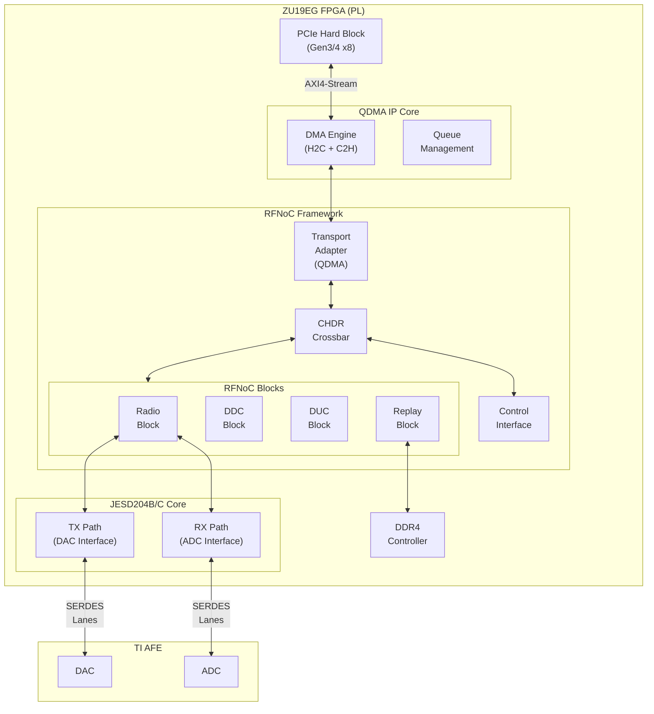
```mermaid
flowchart TB
    subgraph PL["ZU19EG FPGA (PL)"]
        PCIE_HARD["PCIe Hard Block<br/>(Gen3/4 x8)"]

        subgraph QDMA["QDMA IP Core"]
            DMA_ENGINE["DMA Engine<br/>(H2C + C2H)"]
            QUEUE_MGMT["Queue<br/>Management"]
        end

        subgraph RFNOC["RFNoC Framework"]
            TRANSPORT["Transport<br/>Adapter<br/>(QDMA)"]
            CHDR["CHDR<br/>Crossbar"]
            CTRL["Control<br/>Interface"]

            subgraph BLOCKS["RFNoC Blocks"]
                RADIO["Radio<br/>Block"]
                DDC["DDC<br/>Block"]
                DUC["DUC<br/>Block"]
                REPLAY["Replay<br/>Block"]
            end
        end

        subgraph JESD["JESD204B/C Core"]
            TX_PATH["TX Path<br/>(DAC Interface)"]
            RX_PATH["RX Path<br/>(ADC Interface)"]
        end

        DDR4_CTRL["DDR4<br/>Controller"]
    end

    subgraph AFE["TI AFE"]
        DAC_IF["DAC"]
        ADC_IF["ADC"]
    end

    PCIE_HARD <-->|"AXI4-Stream"| DMA_ENGINE
    DMA_ENGINE <--> TRANSPORT
    TRANSPORT <--> CHDR
    CHDR <--> CTRL
    CHDR <--> BLOCKS

    RADIO <--> TX_PATH
    RADIO <--> RX_PATH
    REPLAY <--> DDR4_CTRL

    TX_PATH <-->|"SERDES<br/>Lanes"| DAC_IF
    RX_PATH <-->|"SERDES<br/>Lanes"| ADC_IF
```

---

# Bill of Materials (BOM) - Key Components

## Main Components

| Component | Part Number | Qty | Description |
|-----------|-------------|-----|-------------|
| MPSoC | **XCZU19EG-2FFVC1760I** | 1 | Zynq UltraScale+ |
| AFE | AFE7950 | 1 | RF Transceiver |
| PLL | 8A34001 | 1 | Clock Generator |
| DDR4 (PS) | MT40A512M16TB | 2 | 16Gb DDR4 SDRAM |
| DDR4 (PL) | MT40A256M16GE | 4 | 8Gb DDR4 SDRAM |
| Flash | MT25QU256ABA | 1 | 256Mb QSPI |
| eMMC | MTFC8GAKAJCN | 1 | 8GB eMMC |
| PCIe Conn | 10018783-10111TLF | 1 | PCIe x8 Edge |
| Oscillator | SIT5356AI | 1 | 100MHz TCXO |
| Power | TPS650861 | 1 | PMIC |

---

# Power Architecture

## Power Rails

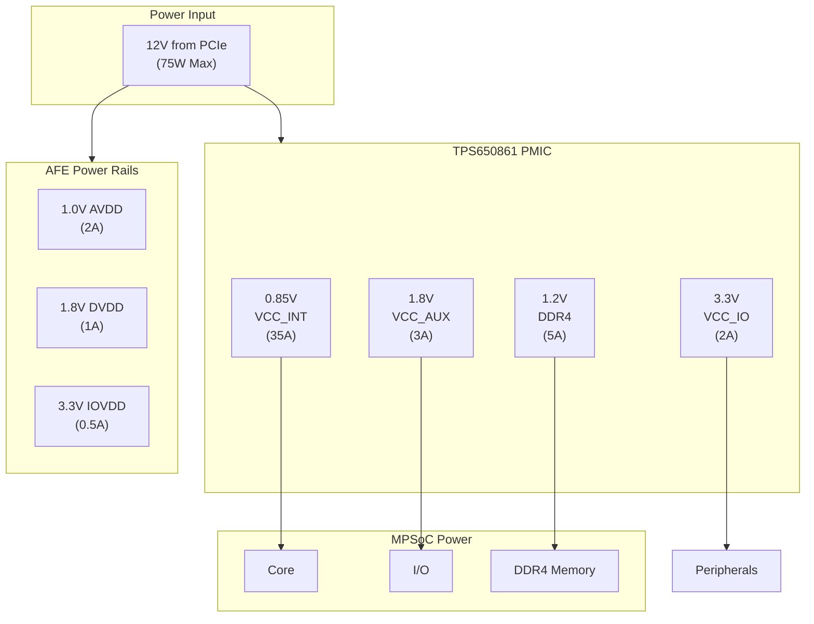
```mermaid
flowchart TB
    subgraph INPUT["Power Input"]
        PCIe_12V["12V from PCIe<br/>(75W Max)"]
    end

    subgraph PMIC["TPS650861 PMIC"]
        direction LR
        VCC_INT["0.85V<br/>VCC_INT<br/>(35A)"]
        VCC_AUX["1.8V<br/>VCC_AUX<br/>(3A)"]
        VCC_IO["3.3V<br/>VCC_IO<br/>(2A)"]
        DDR4_V["1.2V<br/>DDR4<br/>(5A)"]
    end

    subgraph MPSOC_PWR["MPSoC Power"]
        CORE["Core"]
        IO["I/O"]
        DDR["DDR4 Memory"]
    end

    subgraph AFE_PWR["AFE Power Rails"]
        AVDD["1.0V AVDD<br/>(2A)"]
        DVDD["1.8V DVDD<br/>(1A)"]
        IOVDD["3.3V IOVDD<br/>(0.5A)"]
    end

    PCIe_12V --> PMIC
    VCC_INT --> CORE
    VCC_AUX --> IO
    VCC_IO --> PERIPH["Peripherals"]
    DDR4_V --> DDR

    PCIe_12V --> AFE_PWR
```

### Power Budget (ZU19EG)
| Rail | Current | Power |
|------|---------|-------|
| MPSoC Core (0.85V) | 35A | 29.75W |
| MPSoC Aux (1.8V) | 3A | 5.4W |
| DDR4 (1.2V) | 5A | 6W |
| AFE Total | - | 15W |
| **Total** | - | **~60W** |

---

# Development Schedule

## Project Timeline (PCB 완료 기준)

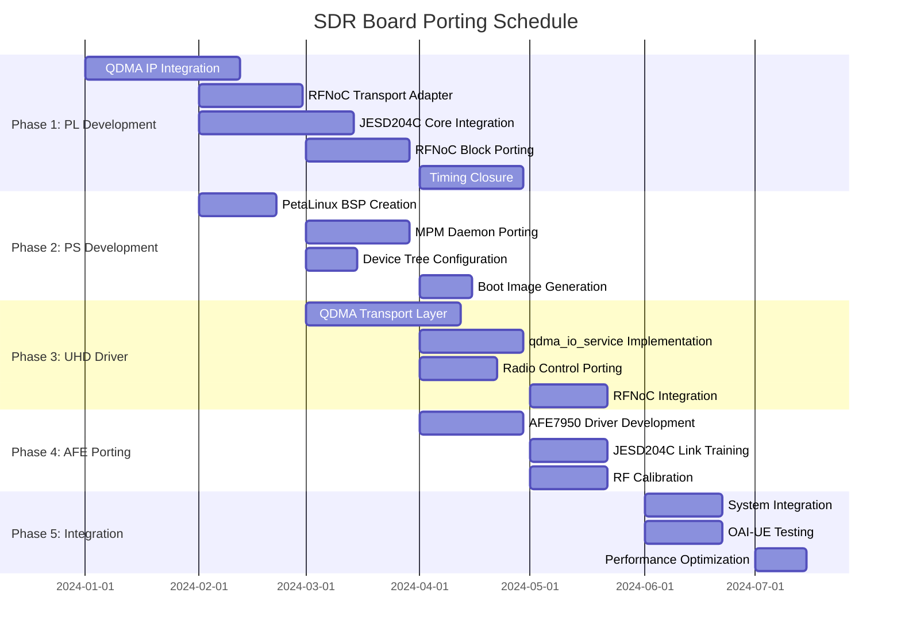
```mermaid
gantt
    title SDR Board Porting Schedule
    dateFormat  YYYY-MM

    section Phase 1: PL Development
    QDMA IP Integration      :p1a, 2024-01, 6w
    RFNoC Transport Adapter  :p1b, 2024-02, 4w
    JESD204C Core Integration:p1c, 2024-02, 6w
    RFNoC Block Porting      :p1d, 2024-03, 4w
    Timing Closure           :p1e, 2024-04, 4w

    section Phase 2: PS Development
    PetaLinux BSP Creation   :p2a, 2024-02, 3w
    MPM Daemon Porting       :p2b, 2024-03, 4w
    Device Tree Configuration:p2c, 2024-03, 2w
    Boot Image Generation    :p2d, 2024-04, 2w

    section Phase 3: UHD Driver
    QDMA Transport Layer     :p3a, 2024-03, 6w
    qdma_io_service Implementation :p3b, 2024-04, 4w
    Radio Control Porting    :p3c, 2024-04, 3w
    RFNoC Integration        :p3d, 2024-05, 3w

    section Phase 4: AFE Porting
    AFE7950 Driver Development :p4a, 2024-04, 4w
    JESD204C Link Training   :p4b, 2024-05, 3w
    RF Calibration           :p4c, 2024-05, 3w

    section Phase 5: Integration
    System Integration       :p5a, 2024-06, 3w
    OAI-UE Testing          :p5b, 2024-06, 3w
    Performance Optimization :p5c, 2024-07, 2w
```

## Phase Details

### Phase 1: PL (Programmable Logic) Development - 6 weeks
- [ ] QDMA IP Core Integration (PCIe Gen3/4 x8)
- [ ] RFNoC Transport Adapter for QDMA
- [ ] JESD204C TX/RX Core Integration
- [ ] RFNoC Block Porting (Radio, DDC, DUC, Replay)
- [ ] Timing Closure & Bitstream Generation

### Phase 2: PS (Processing System) Development - 4 weeks
- [ ] PetaLinux BSP Creation for ZU19EG
- [ ] MPM Daemon Porting from X410
- [ ] Device Tree Configuration
- [ ] Boot Image (BOOT.BIN) Generation

### Phase 3: UHD Driver Development - 6 weeks
- [ ] QDMA Transport Layer (porting from DPDK)
- [ ] `qdma_io_service` Implementation (I/O thread)
- [ ] `qdma_link` Buffer Management
- [ ] Radio Control Block Porting
- [ ] RFNoC Graph Integration

### Phase 4: AFE Porting - 4 weeks
- [ ] TI AFE7950 Driver Development
- [ ] JESD204C Link Training & Verification
- [ ] NCO/DDC/DUC Configuration
- [ ] RF Calibration Routines

### Phase 5: Integration & Testing - 3 weeks
- [ ] Full System Integration
- [ ] OAI-UE End-to-End Testing
- [ ] Performance Optimization
- [ ] Documentation

**Total Duration: ~6 months**

---

# Risk Assessment

## Risk Matrix

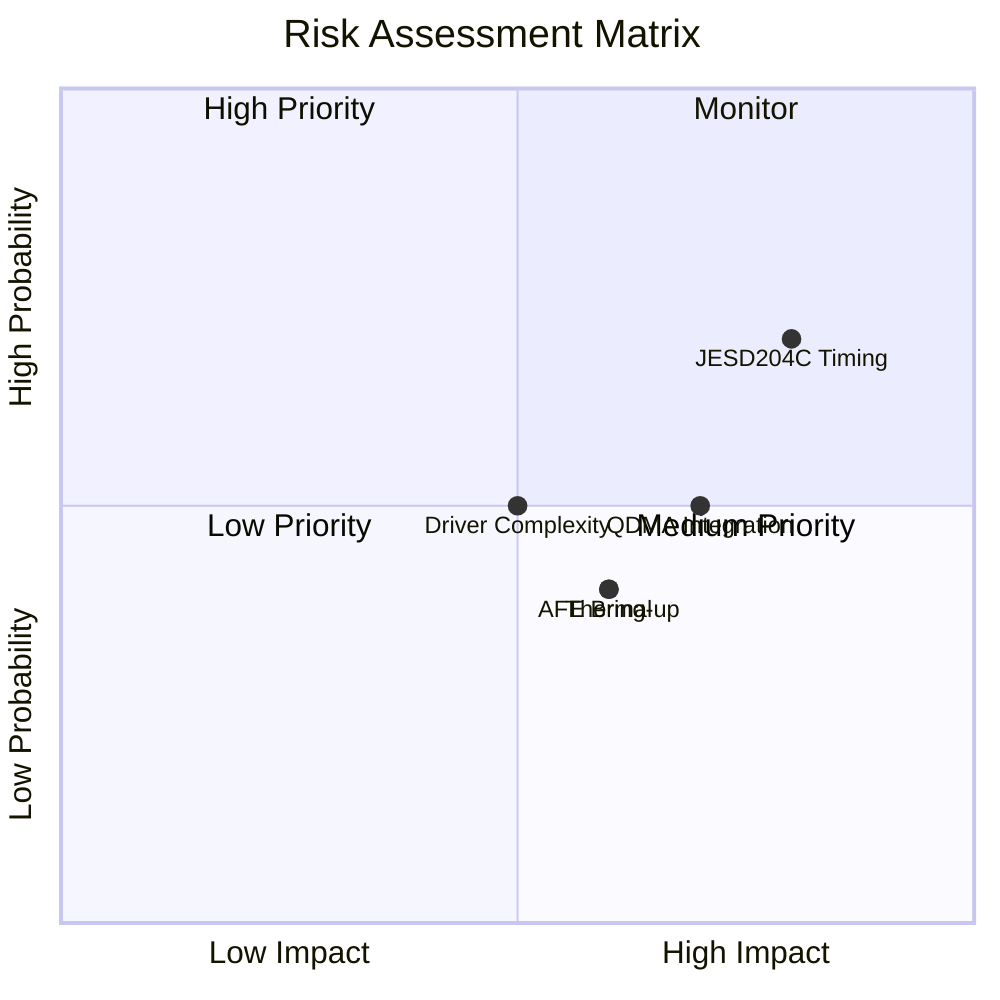
```mermaid
quadrantChart
    title Risk Assessment Matrix
    x-axis Low Impact --> High Impact
    y-axis Low Probability --> High Probability
    quadrant-1 Monitor
    quadrant-2 High Priority
    quadrant-3 Low Priority
    quadrant-4 Medium Priority

    JESD204C Timing: [0.8, 0.7]
    QDMA Integration: [0.7, 0.5]
    Thermal: [0.6, 0.4]
    Driver Complexity: [0.5, 0.5]
    AFE Bring-up: [0.6, 0.4]
```

## Risk Details

| Risk | Impact | Probability | Mitigation |
|------|--------|-------------|------------|
| JESD204C timing | High | High | Early validation, eye diagram analysis |
| QDMA integration | High | Medium | Reference Xilinx examples, incremental testing |
| UHD driver complexity | Medium | Medium | Reuse DPDK patterns, modular design |
| AFE bring-up | Medium | Medium | Use TI EVM for parallel development |
| Thermal management | Medium | Low | Monitor with existing PCB design |

---

# Cost Estimate

## Development Costs (One-time)

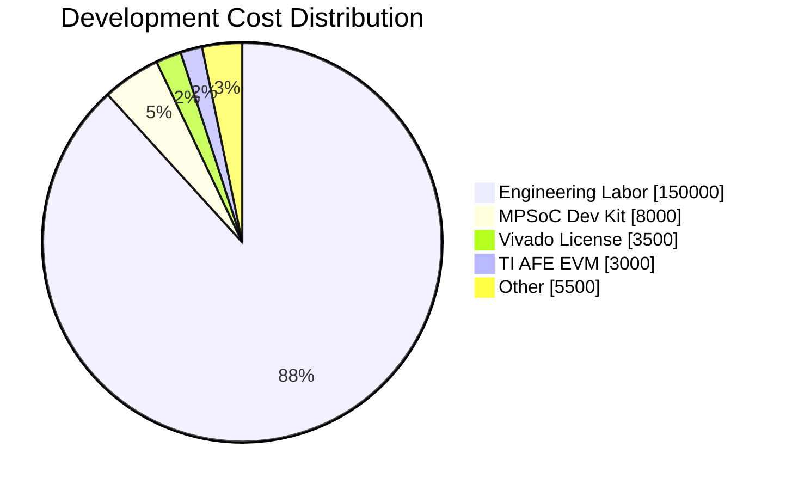
```mermaid
pie showData
    title Development Cost Distribution
    "Engineering Labor" : 150000
    "MPSoC Dev Kit" : 8000
    "Vivado License" : 3500
    "TI AFE EVM" : 3000
    "Other" : 5500
```

| Category | Cost (USD) |
|----------|------------|
| MPSoC Dev Kit (ZCU106) | $8,000 |
| TI AFE EVM | $3,000 |
| Vivado License | $3,500/yr |
| Engineering Labor (6 months) | $150,000 |
| Test Equipment | $5,000 |
| **Total Development** | **~$170,000** |

## Unit Cost (Production)

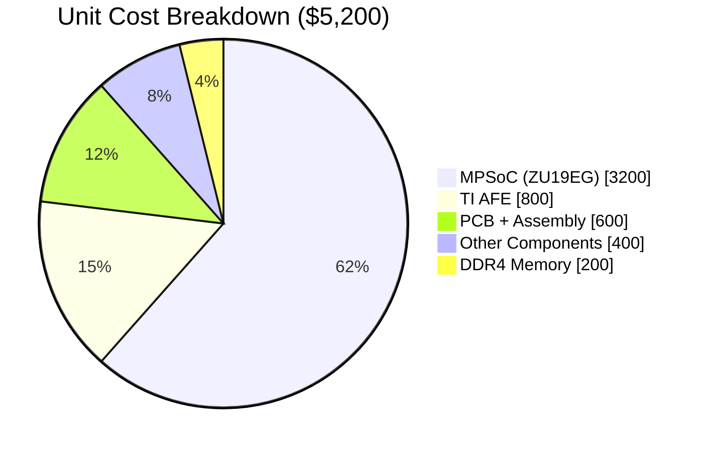
```mermaid
pie showData
    title Unit Cost Breakdown ($5,200)
    "MPSoC (ZU19EG)" : 3200
    "TI AFE" : 800
    "PCB + Assembly" : 600
    "Other Components" : 400
    "DDR4 Memory" : 200
```

| Component | Cost (USD) |
|-----------|------------|
| MPSoC (ZU19EG) | $3,200 |
| TI AFE | $800 |
| DDR4 Memory | $200 |
| PCB + Assembly | $600 |
| Other Components | $400 |
| **Total Unit Cost** | **~$5,200** |

---

# Comparison: X410 vs Custom Board

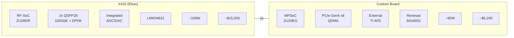
```mermaid
flowchart LR
    subgraph X410["X410 (Ettus)"]
        direction TB
        X_SOC["RF-SoC<br/>ZU28DR"]
        X_IF["2x QSFP28<br/>100GbE + DPDK"]
        X_ADC["Integrated<br/>ADC/DAC"]
        X_PLL["LMK04832"]
        X_PWR["~100W"]
        X_PRICE["~$15,000"]
    end

    subgraph CUSTOM["Custom Board"]
        direction TB
        C_SOC["MPSoC<br/>ZU19EG"]
        C_IF["PCIe Gen4 x8<br/>QDMA"]
        C_ADC["External<br/>TI AFE"]
        C_PLL["Renesas<br/>8A34001"]
        C_PWR["~60W"]
        C_PRICE["~$5,200"]
    end

    X410 ---|"vs"| CUSTOM
```

## Detailed Comparison

| Feature | X410 | Custom Board |
|---------|------|--------------|
| SoC Type | RF-SoC (ZU28DR) | MPSoC (ZU19EG) |
| Logic Cells | 930K | **1,143K** |
| ADC/DAC | Integrated | External (TI AFE) |
| Host Interface | 2x QSFP28 (DPDK) | **PCIe Gen4 x8 (QDMA)** |
| Latency | ~100μs (Network) | **~3-5μs (PCIe)** |
| Bandwidth | 200 Gbps | 15.75 GB/s |
| PLL | LMK04832 | Renesas 8A34001 |
| RF Bandwidth | 400 MHz | 400 MHz |
| Channels | 4T4R | 4T4R |
| Power | ~100W | **~60W** |
| Form Factor | Standalone | PCIe Card |
| Price | ~$15,000 | **~$5,200** |

---

# DPDK to QDMA Porting Guide

## Key Mapping

| DPDK Component | QDMA Equivalent |
|----------------|-----------------|
| `rte_eth_rx_burst()` | `qdma_queue_c2h_read()` |
| `rte_eth_tx_burst()` | `qdma_queue_h2c_write()` |
| `rte_mbuf` | QDMA descriptor + buffer |
| `rte_ring` | QDMA completion ring |
| `dpdk_io_service` | `qdma_io_service` |
| `udp_dpdk_link` | `qdma_link` |
| IPv4 5-tuple routing | Queue ID routing |
| ARP resolution | Not needed (direct DMA) |

## Implementation Priority

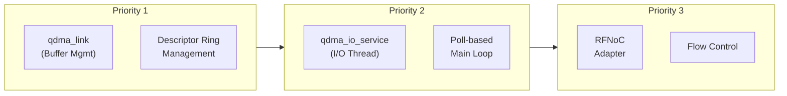
```mermaid
flowchart LR
    subgraph P1["Priority 1"]
        QDMA_LINK["qdma_link<br/>(Buffer Mgmt)"]
        DESC_RING["Descriptor Ring<br/>Management"]
    end

    subgraph P2["Priority 2"]
        IO_SVC["qdma_io_service<br/>(I/O Thread)"]
        POLL_LOOP["Poll-based<br/>Main Loop"]
    end

    subgraph P3["Priority 3"]
        RFNOC_ADAPT["RFNoC<br/>Adapter"]
        FLOW_CTRL["Flow Control"]
    end

    P1 --> P2 --> P3
```

---

# Next Steps

## Immediate Actions

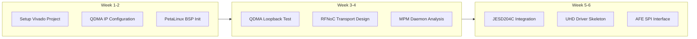
```mermaid
flowchart LR
    subgraph WEEK1["Week 1-2"]
        A1["Setup Vivado Project"]
        A2["QDMA IP Configuration"]
        A3["PetaLinux BSP Init"]
    end

    subgraph WEEK3["Week 3-4"]
        B1["QDMA Loopback Test"]
        B2["RFNoC Transport Design"]
        B3["MPM Daemon Analysis"]
    end

    subgraph WEEK5["Week 5-6"]
        C1["JESD204C Integration"]
        C2["UHD Driver Skeleton"]
        C3["AFE SPI Interface"]
    end

    WEEK1 --> WEEK3 --> WEEK5
```

1. **PL Development Setup**
   - Create Vivado project for ZU19EG
   - Configure QDMA IP (Gen3/4 x8, Streaming mode)
   - Integrate RFNoC framework

2. **PS Development Setup**
   - Create PetaLinux BSP
   - Port MPM daemon from X410
   - Configure boot sequence

3. **Host Driver Setup**
   - Clone UHD repository
   - Create QDMA transport branch
   - Setup development environment

---

# Contact & Resources

## Project Resources
- **UHD Repository**: github.com/EttusResearch/uhd
- **X410 Documentation**: files.ettus.com/manual
- **TI AFE Resources**: ti.com/product/AFE7950
- **QDMA Guide**: Xilinx PG302

## Key Reference Files
- `host/lib/transport/uhd-dpdk/dpdk_io_service.cpp`
- `host/lib/transport/udp_dpdk_link.cpp`
- `host/lib/usrp/x400/x400_radio_control.cpp`
- `mpm/python/usrp_mpm/periph_manager/x4xx.py`

---

# Thank You

## Questions?

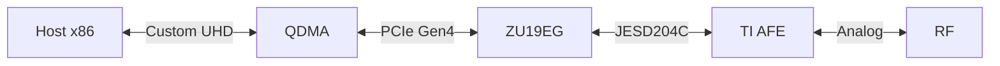
```mermaid
flowchart LR
    HOST["Host x86"]
    QDMA["QDMA"]
    MPSOC["ZU19EG"]
    AFE["TI AFE"]
    RF["RF"]

    HOST <-->|"Custom UHD"| QDMA
    QDMA <-->|"PCIe Gen4"| MPSOC
    MPSOC <-->|"JESD204C"| AFE
    AFE <-->|"Analog"| RF
```

### Custom SDR Board Project
### X410 Clone with MPSoC + QDMA Architecture
