# Custom SDR Board Project Plan
## X410 Clone with MPSoC Architecture

---

# Project Overview

## Goal
X410 기반 Custom SDR 보드 개발

## Key Differences from X410
| Feature | X410 | Custom Board |
|---------|------|--------------|
| SoC | RF-SoC (ZU28DR) | MPSoC |
| ADC/DAC | Integrated | External (TI AFE) |
| Host Interface | Ethernet | PCIe |
| PLL | LMK04832 | Renesas 8A34001 |

---

# System Architecture

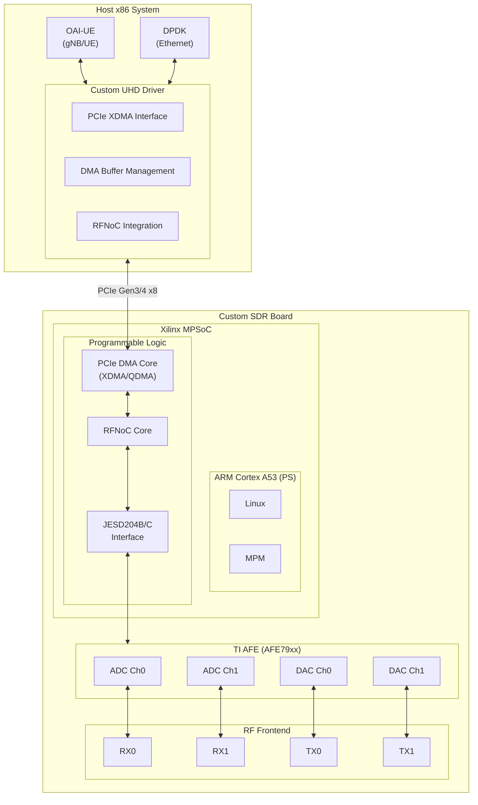

---

# MPSoC Selection

## Recommended Devices

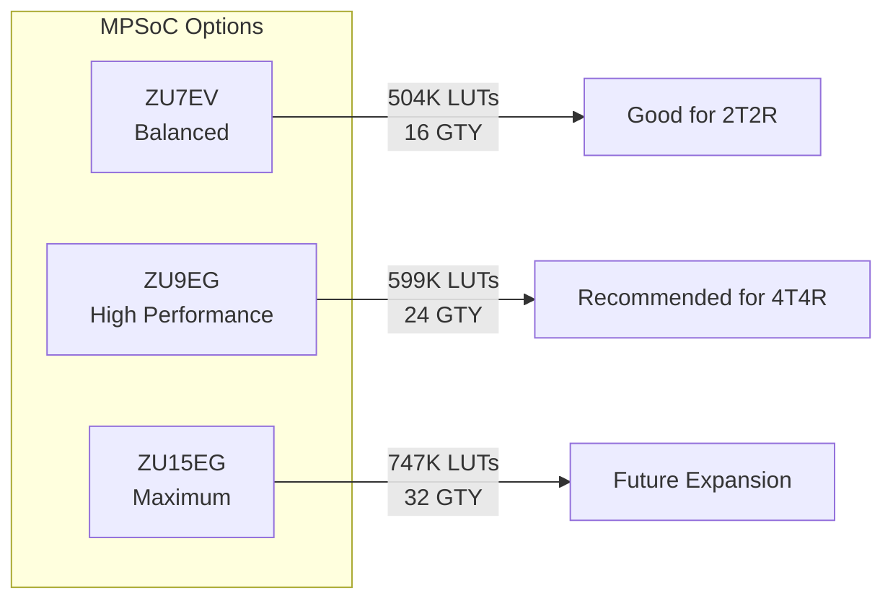

### Option 1: ZU9EG (High Performance) - Recommended
- **PL Logic Cells**: 599K
- **Block RAM**: 32.1 Mb
- **GTY Transceivers**: 24
- **DSP Slices**: 2,520
- **PS DDR4**: Up to 2400 MT/s

### Option 2: ZU7EV (Balanced)
- **PL Logic Cells**: 504K
- **Block RAM**: 26.1 Mb
- **GTY Transceivers**: 16
- **DSP Slices**: 1,728

### Option 3: ZU15EG (Maximum Performance)
- **PL Logic Cells**: 747K
- **Block RAM**: 38.9 Mb
- **GTY Transceivers**: 32
- **DSP Slices**: 3,528

---

# TI AFE Selection

## AFE7950 (Recommended)

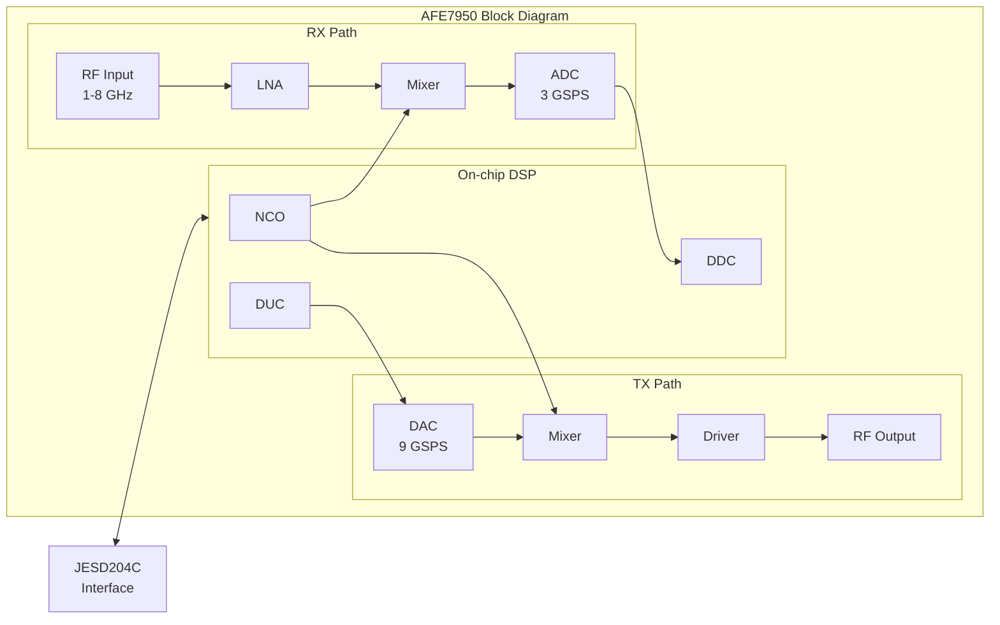

### Specifications
| Parameter | Value |
|-----------|-------|
| ADC Channels | 4 |
| DAC Channels | 4 |
| ADC Sample Rate | 3 GSPS |
| DAC Sample Rate | 9 GSPS |
| RF Bandwidth | 400 MHz |
| Interface | JESD204C |

### Features
- Direct RF sampling up to 8 GHz
- Integrated NCO per channel
- On-chip DSP (DDC/DUC)
- Internal LO synthesis

## Alternatives
- **AFE7903**: 2T2R, lower cost
- **AFE7920**: 4T4R, higher integration

---

# Clock Architecture

## Renesas 8A34001 Network Synchronizer

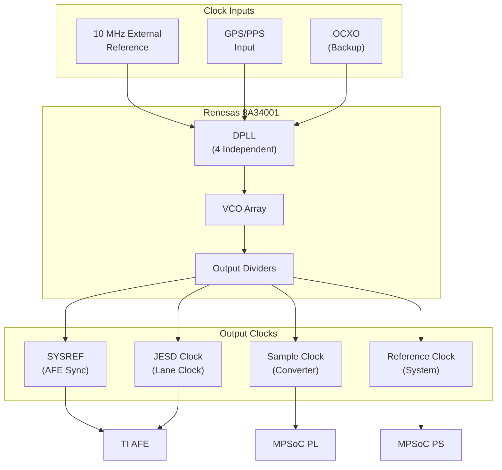

### Key Features
- 4 independent DPLLs
- Sub-ns jitter performance (<100 fs RMS)
- IEEE 1588/SyncE support
- Programmable via I2C/SPI

---

# PCIe Interface Design

## XDMA Architecture

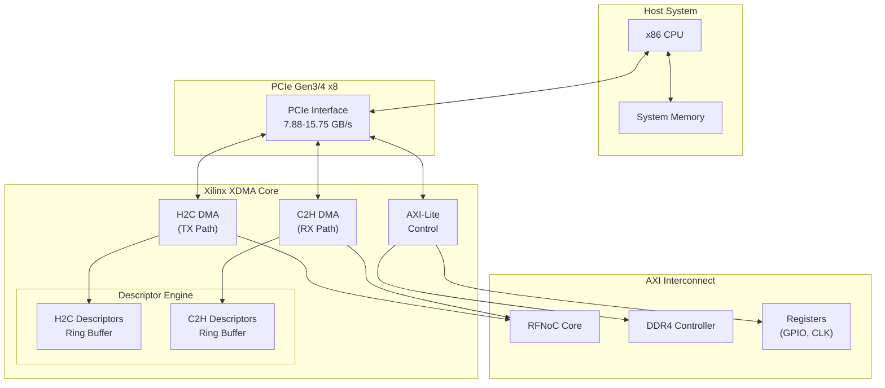

## Performance Targets
| Metric | Gen3 x8 | Gen4 x8 |
|--------|---------|---------|
| Theoretical BW | 7.88 GB/s | 15.75 GB/s |
| Effective BW | ~6.5 GB/s | ~13 GB/s |
| Latency | < 10 μs | < 5 μs |

---

# Software Architecture

## Custom UHD Driver Stack

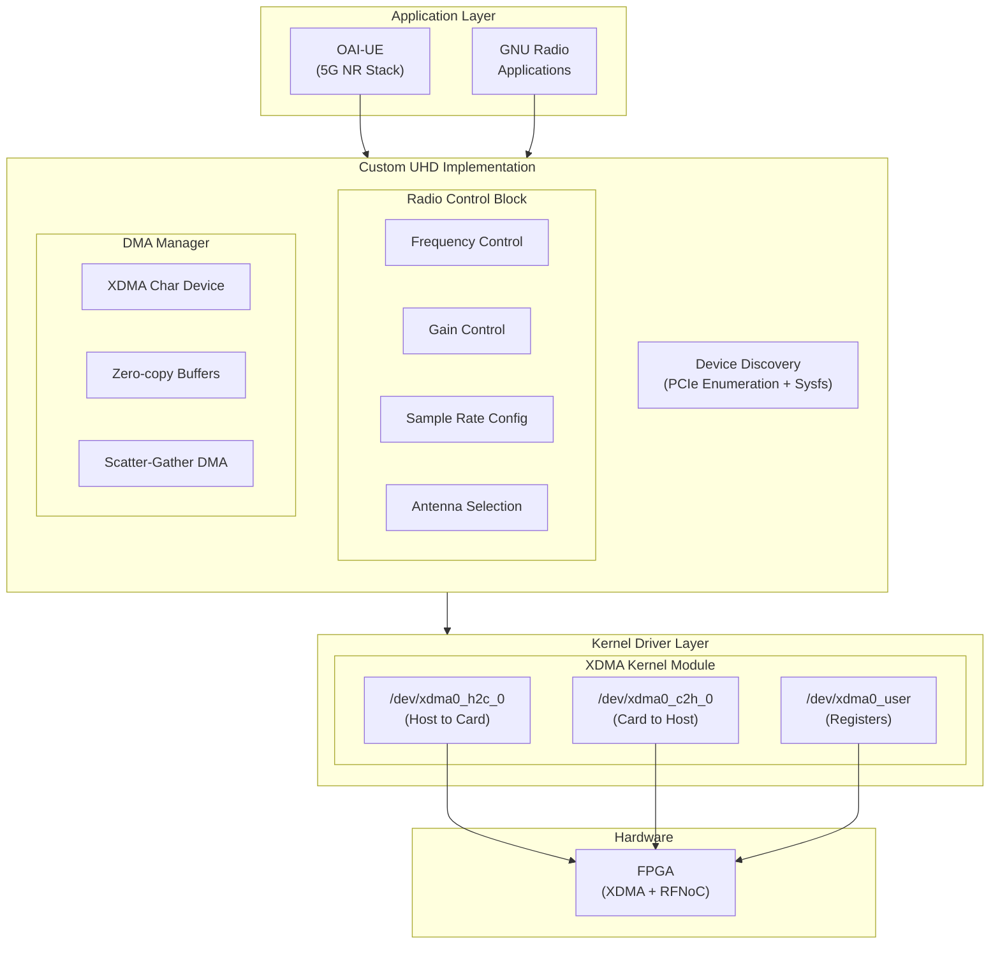

---

# FPGA Architecture

## Top-Level Block Diagram

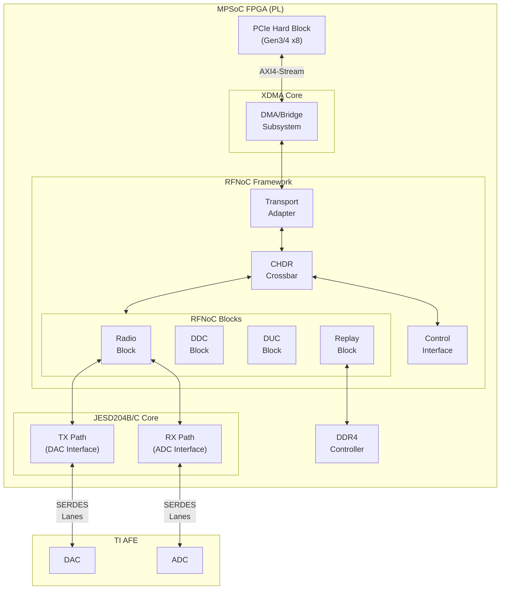

---

# Bill of Materials (BOM) - Key Components

## Main Components

| Component | Part Number | Qty | Description |
|-----------|-------------|-----|-------------|
| MPSoC | XCZU9EG-2FFVB1156I | 1 | Zynq UltraScale+ |
| AFE | AFE7950 | 1 | RF Transceiver |
| PLL | 8A34001 | 1 | Clock Generator |
| DDR4 (PS) | MT40A512M16TB | 2 | 16Gb DDR4 SDRAM |
| DDR4 (PL) | MT40A256M16GE | 4 | 8Gb DDR4 SDRAM |
| Flash | MT25QU256ABA | 1 | 256Mb QSPI |
| eMMC | MTFC8GAKAJCN | 1 | 8GB eMMC |
| PCIe Conn | 10018783-10111TLF | 1 | PCIe x8 Edge |
| Oscillator | SIT5356AI | 1 | 100MHz TCXO |
| Power | TPS650861 | 1 | PMIC |

---

# Power Architecture

## Power Rails

### Power Budget
| Rail | Current | Power |
|------|---------|-------|
| MPSoC Core (0.85V) | 30A | 25.5W |
| MPSoC Aux (1.8V) | 3A | 5.4W |
| DDR4 (1.2V) | 5A | 6W |
| AFE Total | - | 15W |
| **Total** | - | **~55W** |

---

# Development Phases

## Project Timeline

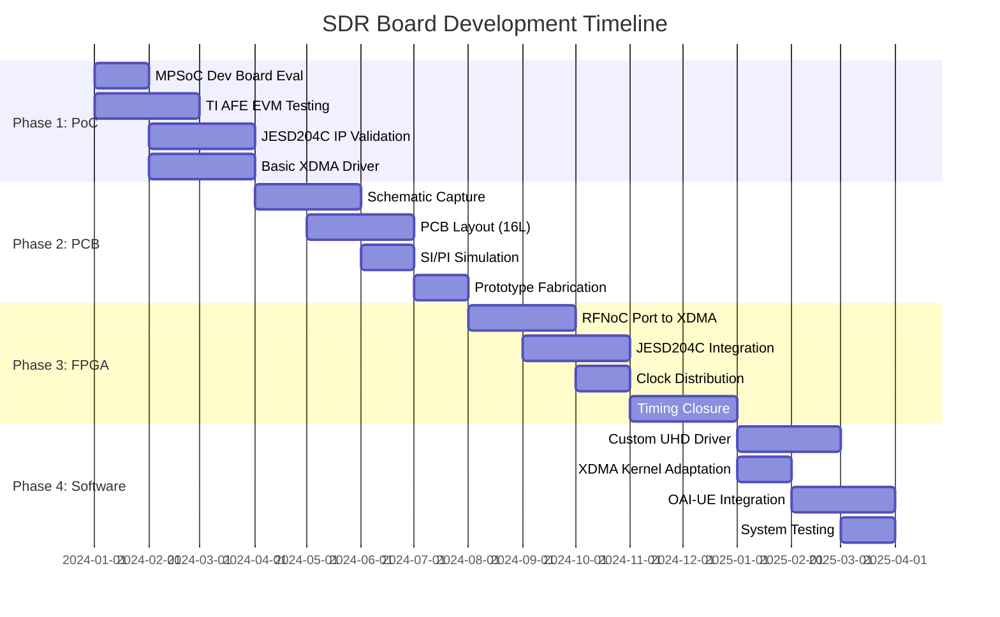

## Phase Details

### Phase 1: Proof of Concept
- [ ] MPSoC development board evaluation
- [ ] TI AFE evaluation module testing
- [ ] JESD204B/C IP core validation
- [ ] Basic XDMA driver development

### Phase 2: Schematic & PCB
- [ ] Schematic capture (Altium/OrCAD)
- [ ] PCB layout (16+ layers)
- [ ] SI/PI simulation
- [ ] BOM optimization

### Phase 3: FPGA Development
- [ ] RFNoC port to XDMA
- [ ] JESD204C integration
- [ ] Clock distribution logic
- [ ] Timing closure

### Phase 4: Software Development
- [ ] Custom UHD driver (PCIe backend)
- [ ] XDMA kernel module adaptation
- [ ] MPM porting (if needed)
- [ ] OAI-UE integration testing

---

# Risk Assessment

## Risk Matrix

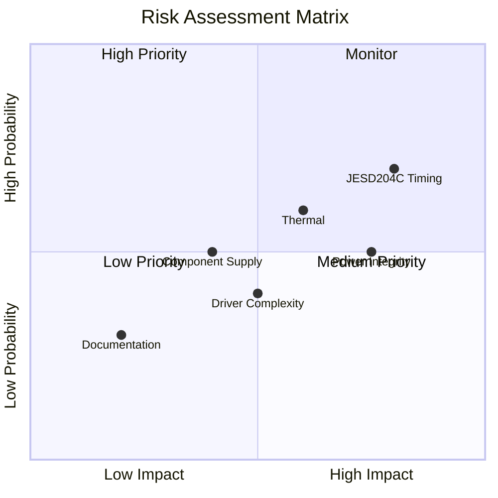

## Risk Details

| Risk | Impact | Probability | Mitigation |
|------|--------|-------------|------------|
| JESD204C timing | High | High | Early validation on eval kit |
| Power integrity | High | Medium | Extensive SI/PI simulation |
| Thermal management | Medium | Medium | Proper heatsink design |
| UHD driver complexity | Medium | Medium | Modular approach |
| Component availability | Medium | Medium | Second source planning |
| Documentation gaps | Low | Low | Regular documentation |

---

# Cost Estimate

## Cost Breakdown

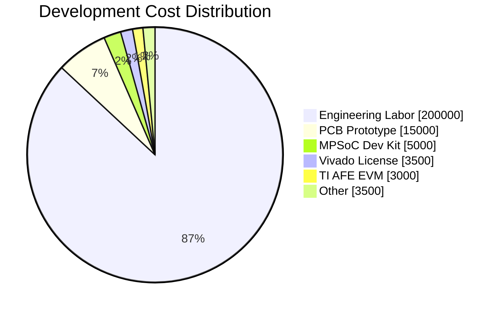

## Development Costs (One-time)

| Category | Cost (USD) |
|----------|------------|
| MPSoC Dev Kit | $5,000 |
| TI AFE EVM | $3,000 |
| Vivado License | $3,500/yr |
| PCB Prototype (5 units) | $15,000 |
| Engineering Labor | $200,000 |
| **Total Development** | **~$230,000** |

## Unit Cost (Production)

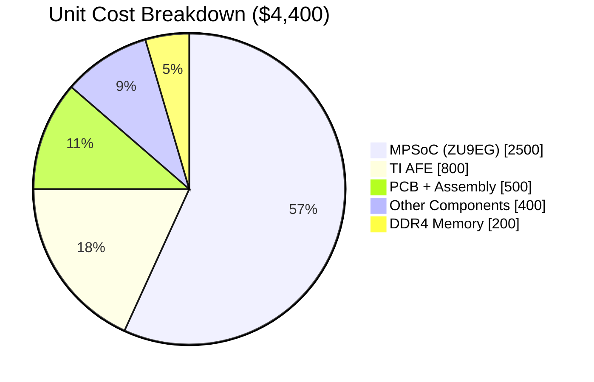

| Component | Cost (USD) |
|-----------|------------|
| MPSoC (ZU9EG) | $2,500 |
| TI AFE | $800 |
| DDR4 Memory | $200 |
| PCB + Assembly | $500 |
| Other Components | $400 |
| **Total Unit Cost** | **~$4,400** |

---

# Comparison: X410 vs Custom Board

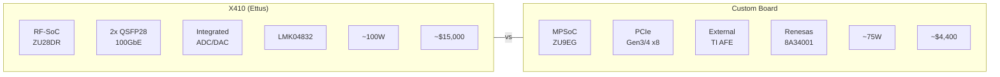

## Detailed Comparison

| Feature | X410 | Custom Board |
|---------|------|--------------|
| SoC Type | RF-SoC (ZU28DR) | MPSoC (ZU9EG) |
| ADC/DAC | Integrated | External (TI AFE) |
| Host Interface | 2x QSFP28 (100GbE) | PCIe Gen3/4 x8 |
| Latency | ~1ms (Network) | **~10μs (PCIe)** |
| Bandwidth | 200 Gbps | 15.75 GB/s |
| PLL | LMK04832 | Renesas 8A34001 |
| RF Bandwidth | 400 MHz | 400 MHz |
| Channels | 4T4R | 4T4R (or 2T2R) |
| Power | ~100W | ~75W (PCIe limit) |
| Form Factor | Standalone | PCIe Card |
| Price | ~$15,000 | **~$4,400** |

---

# Target Applications

## Use Case Diagram

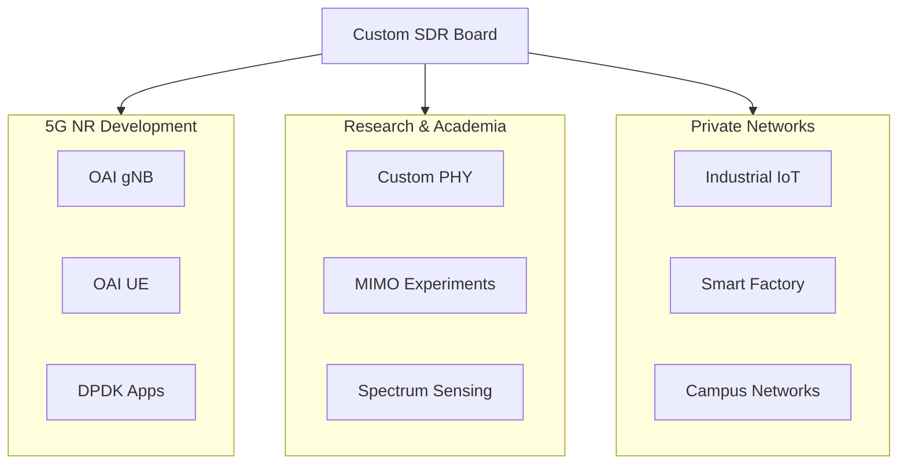

## Primary Use Cases

### 5G NR Development
- OAI gNB/UE testing
- Low-latency requirements (<10μs)
- DPDK integration for packet processing

### Research & Academia
- Custom PHY algorithms
- MIMO experiments
- Spectrum sensing

### Private Networks
- Industrial IoT
- Smart factory
- Campus networks

---

# Next Steps

## Action Items

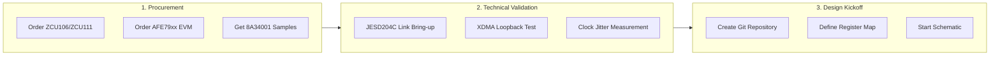

## Immediate Actions

1. **Procurement**
   - Order MPSoC evaluation kit (ZCU106/ZCU111)
   - Order TI AFE79xx EVM
   - Obtain Renesas 8A34001 samples

2. **Technical Validation**
   - JESD204C link bring-up
   - XDMA loopback testing
   - Clock jitter measurement

3. **Design Kickoff**
   - Create project repository
   - Define register map
   - Start schematic design

---

# Contact & Resources

## Project Resources
- **UHD Repository**: github.com/EttusResearch/uhd
- **X410 Documentation**: files.ettus.com/manual
- **TI AFE Resources**: ti.com/product/AFE7950

## References
- X410 Hardware Manual
- JESD204B/C Specification
- Xilinx XDMA Product Guide (PG195)
- Renesas 8A34001 Datasheet

---

# Thank You

## Questions?

### Custom SDR Board Project
### X410 Clone with MPSoC Architecture
