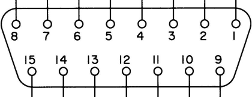

========================================================================
UHD - X3x0 GPIO API
========================================================================

.. contents:: Table of Contents

------------------------------------------------------------------------
The X3x0 Front Panel GPIO
------------------------------------------------------------------------
The X3x0 is the first USRP device to offer an auxiliary GPIO connection on the
motherboard itself (independent of the daughterboards). These GPIO pins are
controlled directly by the FPGA, where they are controlled by an ATR (Automatic
Transmit / Receive). This allows them to be toggled simultaneously with other
radio-level changes (e.g., enabling or disabling a TX or RX mixer).

^^^^^^^^^^^^^^^^
Front Panel GPIO
^^^^^^^^^^^^^^^^

Connector
:::::::::

Pin Mapping
:::::::::::

* Pin 1:  +3.3V
* Pin 2:  Data[0]
* Pin 3:  Data[1]
* Pin 4:  Data[2]
* Pin 5:  Data[3]
* Pin 6:  Data[4]
* Pin 7:  Data[5]
* Pin 8:  Data[6]
* Pin 9:  Data[7]
* Pin 10: Data[8]
* Pin 11: Data[9]
* Pin 12: Data[10]
* Pin 13: Data[11]
* Pin 14: 0V
* Pin 15: 0V

^^^^^^^^^^^^^^^^^^^^^^^^^^^^^
Explaining ATR
^^^^^^^^^^^^^^^^^^^^^^^^^^^^^

ATR works by defining the value of the GPIO pins for certain states of the
radio. This is the "automatic" part of it. For example, you can tell UHD that
when the radio is transmitting and receiving (full duplex), GPIO6 should be
high, but when it is only transmitting, GPI06 should be low. This state machine
is set up using a series of GPIO attributes, with paired values and a mask,
which you will want to define for the GPIO pins you intend to use. To set up
the ATR, you use the **multi_usrp** function *set_gpio_attr*. 

* **CTRL**: Is this pin controlled by ATR (automatic), or by manual control
  only?
* **DDR**: "Data Direction Register" - defines whether or not a GPIO is an
  output or an input.
* **OUT**: Manually set the value of a pin (only to be used in non-ATR mode).
* **ATR_0X**: The status of the pins when the radio is **idle**.
* **ATR_RX**: The status of the pins when the radio is only **receiving**.
* **ATR_TX**: The status of the pins when the radio is only **transmitting**.
* **ATR_XX**: The status of the pins when the radio is in **full-duplex** mode.

The counterpart to setting the ATR (the "getter"), is called *get_gpio_attr*.
It has the exact same attributes as above, and has one more:

* **READBACK**: Readback the GPIOs marked as inputs.

^^^^^^^^^^^^^^^^^^^^^^^^^^^^^
An Example
^^^^^^^^^^^^^^^^^^^^^^^^^^^^^
The front panel X3x0 GPIO bank is enumerated in the motherboard property tree
("*<mb_path>/gpio/FP0/*"), and so is easily accessible through the standard
**multi_usrp** UHD interface.

You can discover this using the *get_gpio_banks* function in **multi_usrp**.
This will tell you that there is a GPIO bank on your X3x0 called "FP0". This is
the bank we want to set-up.

Let's say we want to use GPIO6 for an external amp. We want it to be
automatically controlled by ATR as an output, and we want it to be high when we
are transmitting, and low in all other cases. We are also using GPIO4, which
we want to control manually, as an output. We can set this up with the following
code:

::

    // set up our masks, defining the pin numbers
    #define AMP_GPIO_MASK   (1 << 6)
    #define MAN_GPIO_MASK   (1 << 4)

    #define ATR_MASKS       (AMP_GPIO_MASK | MAN_GPIO_MASK)

    // set up our values for ATR control: 1 for ATR, 0 for manual
    #define ATR_CONTROL     (AMP_GPIO_MASK & ~MAN_GPIO_MASK)

    // set up the GPIO directions: 1 for output, 0 for input
    #define GPIO_DDR        (AMP_GPIO_MASK & ~MAN_GPIO_MASK)

    // assume an existing USRP device handle, called "usrp_x300"

    // now, let's do the basic ATR setup
    usrp_x300->set_gpio_attr("FP0", "CTRL", ATR_CONTROL, ATR_MASKS);
    usrp_x300->set_gpio_attr("FP0", "DDR", GPIO_DDR, ATR_MASKS);

    // let's manually set GPIO4 high
    usrp_x300->set_gpio_attr("FP0", "OUT", 1, MAN_GPIO_MASK);

    // finally, let's set up GPIO6 as we described above
    usrp_x300->set_gpio_attr("FP0", "ATR_0X", 0, AMP_GPIO_MASK);
    usrp_x300->set_gpio_attr("FP0", "ATR_RX", 0, AMP_GPIO_MASK);
    usrp_x300->set_gpio_attr("FP0", "ATR_TX", 0, AMP_GPIO_MASK);
    usrp_x300->set_gpio_attr("FP0", "ATR_XX", 0, AMP_GPIO_MASK);

After the above code is run, the ATR in the FPGA will automatically control
GPIO6, as we have described, based on the radio state, and we have direct
manual control over GPIO4.

^^^^^^^^^^^^^^^^^^^^^^^^^^^^^
Further Information
^^^^^^^^^^^^^^^^^^^^^^^^^^^^^
For more information, see the Doxygen API documentation:

* `multi_usrp API <./../../doxygen/html/classuhd_1_1usrp_1_1multi__usrp.html>`_
